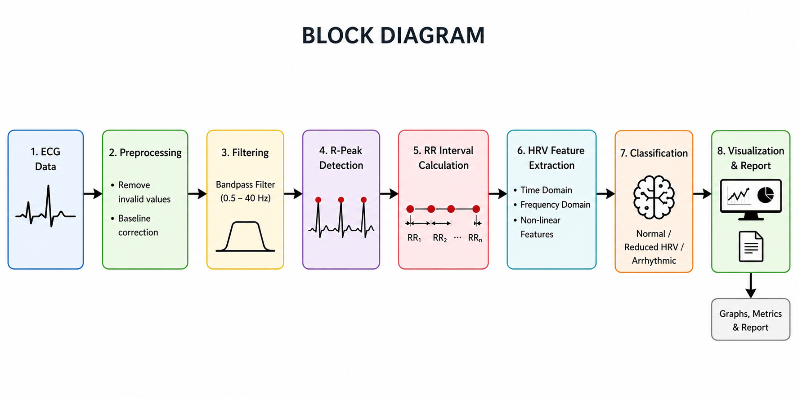
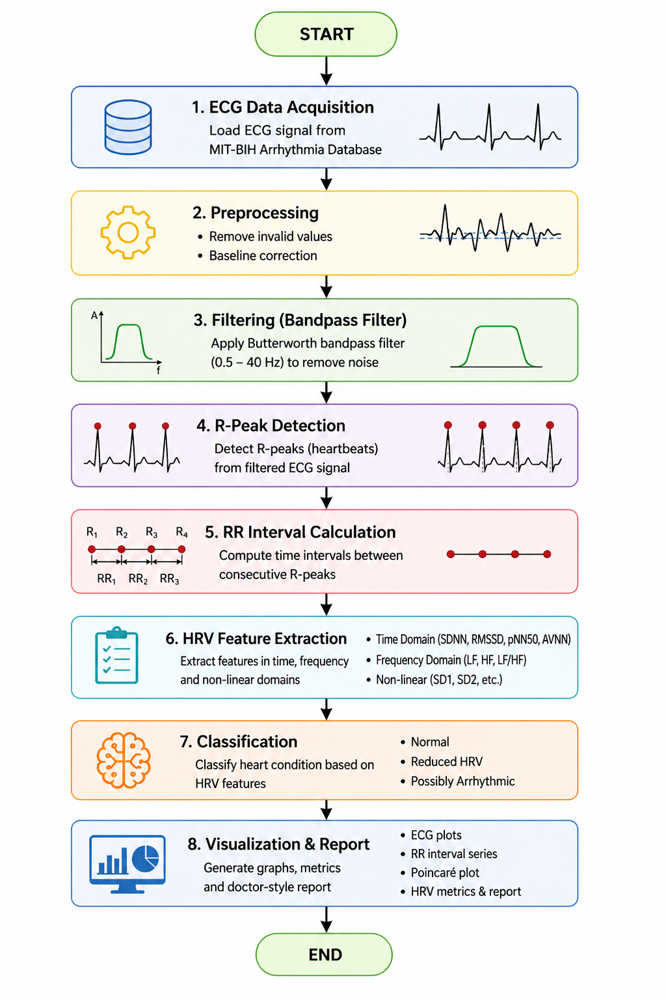

# 🫀 Early Detection of Cardiovascular Diseases using HRV Patterns on ECG Signals

## 📌 Introduction
* Cardiovascular diseases (CVDs) are one of the leading causes of death worldwide.
* Early detection is essential to reduce mortality and improve patient outcomes.
* This project focuses on analyzing **Heart Rate Variability (HRV)** derived from **Electrocardiogram (ECG)** signals.
* HRV reflects the autonomic nervous system and helps in identifying early cardiac abnormalities.

---

## 📖 Overview
* This project implements a **Digital Signal Processing (DSP)-based system**.
* It processes ECG signals and extracts HRV features.
* The system analyzes heart conditions and classifies them.

### Key Features:
* Non-invasive method
* Cost-effective solution
* Suitable for continuous monitoring
* Uses PhysioNet (MIT-BIH Arrhythmia Database)

---

## ⚙️ Methodology / Steps of Project

### * Step 1: ECG Data Collection
* ECG signals are collected from MIT-BIH Arrhythmia Database
* Sampling frequency: 360 Hz

### * Step 2: Preprocessing
* Remove invalid values (NaN, Inf)
* Ensure clean and usable signal

### * Step 3: Noise Removal (Filtering)
* Apply Butterworth Bandpass Filter (0.5–40 Hz)
* Removes:
  * Baseline drift
  * Muscle noise
  * Power-line interference

### * Step 4: R-Peak Detection
* Detect peaks representing heartbeats
* Maintain minimum distance between peaks

### * Step 5: RR Interval Calculation
* Calculate time between consecutive R-peaks
* Used for HRV analysis

### * Step 6: HRV Feature Extraction
* AVNN – Average NN interval
* SDNN – Standard deviation
* RMSSD – Short-term variation
* pNN50 – Percentage variation

### * Step 7: Heart Rate Estimation
* Calculate heart rate in beats per minute (bpm)

### * Step 8: HRV Classification
* Normal HRV
* Reduced HRV
* Possibly Arrhythmic

### * Step 9: AO & GJ Peak Estimation
* AO = R + 80 ms
* GJ = R + 110 ms

### * Step 10: Visualization & Report Generation
* ECG plots
* RR interval graphs
* Poincaré plots
* Doctor-style report

---

## 🧠 Block Diagram

## 🔄 Flow Diagram

---

## 📊 Results
* Accurate R-peak detection achieved
* Clear RR interval patterns observed
* HRV features successfully extracted
* System differentiates:
  * Normal ECG
  * Abnormal ECG

### Observations:
* Filtered ECG improves signal clarity
* Poincaré plots show variability patterns
* RR intervals indicate heart stability

---

## 🏁 Conclusion
* The project provides an effective method for early cardiovascular disease detection.
* HRV-based ECG analysis is:
  * Reliable
  * Non-invasive
  * Cost-efficient

### Achievements:
* Accurate ECG signal processing
* Efficient HRV feature extraction
* Automated classification system
* Doctor-style report generation

---

## 🔮 Future Scope
* Integration of Machine Learning and Deep Learning
* Real-time monitoring using wearable devices
* Cloud-based healthcare systems
* Mobile application development
* Multi-parameter analysis (BP, SpO2)
* Large-scale clinical validation

---

## 📚 References
* PhysioNet ECG Database
* MIT-BIH Arrhythmia Database
* Research papers on HRV analysis

---

## 👨‍💻 Authors
* Prashant Pattar
* Chinmay Dhawale
* Rakshita K
* Soumya Katti

---

## 🛠️ Tools & Technologies
* MATLAB / Python
* NumPy, SciPy
* Signal Processing Techniques
* ECG Databases (PhysioNet)

---

## ⭐ Support
* If you like this project, give it a ⭐ on GitHub!
